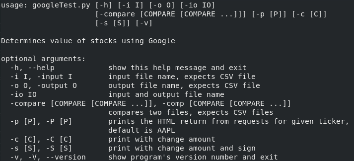

# Stock-Scraper
Python scripts that can scrape stock, ETF, Mutual Fund price values from search engines

## Table of Contents
 - Table of Contents
 - Requirements
 - Background
 - Script Files
 - Miscellaneous Files
 - How to Use
   - Setting Up the CSV File
   - The Flags
   - Examples
   - Warning
- Future Work

## Requirements
Python 3 (tested on 3.6.8)
  Libraries (come standard in Python 3):
- requests
- csv
- argparse
- os.path

## Background
***NOTE: The data is not representative of any person's actual portfolio, it was made up for testing purposes. The stock prices are real data for stock prices scraped from the search engines.***
  &nbsp;&nbsp;&nbsp;&nbsp;I wanted to make something that could quickly tell a user what their portfolio was worth without requiring them to log on anywhere. Before creating this web scraper I tried using the following libraries: quandl, yahoo_fin, and yfinance. They did not give the desired results, so I tried using the financialmodelingprep API, but that did not have all the stock tickers available. It also requires an API key now.
 &nbsp;&nbsp;&nbsp;&nbsp;So, that is when I tried scraping Google's search engine. The downside is that it requires a gibberish identifier to be able to determine what the price was. It seems to remain constant for the requests library, but if you were trying to find it in the source code of your HTML returns it will change. (The -p flag was designed to combat the gibberish changing, this will be discussed on the Google readme). Therefore, I wanted an easier solution that would not require the user to need to go through the HTML source code to find the new gibberish in the event that it does change.
 &nbsp;&nbsp;&nbsp;&nbsp;I began by looking up other search engines, I went through many, but the only ones that had potential were Yahoo, Bing, and OneSearch. Bing  was not useful as the price value was not available in the HTML source code. Yahoo had plenty of information, but it would have been a chore to parse through the HTML code, so I decided to skip that one. OneSearch had a consistent identifier which made it the obvious choice.
 &nbsp;&nbsp;&nbsp;&nbsp;NOTE: I also quickly tried scraping from MarketWatch and WSJ, but they have measures to prevent scraping.

## Script Files
**oneSearch/oneSearch.py** - uses OneSearch's search engine to scrape stock data
 **google/googleTest.py** - uses Google's search engine to scrape stock data

## Miscellaneous Files
See these folders for the files...
 **csvFiles/** - CSV files used to create the output text files using **oneSearch.py**
 link to csvFiles: https://github.com/imschwartz89/Stock-Scraper/tree/main/csvFiles
 **outputs/** - the outputs after running **oneSearch.py** on given data from **csvFiles/**
 link to outputs: https://github.com/imschwartz89/Stock-Scraper/tree/main/outputs

## How to Use

*NOTE: All commands using python3 refer to using Python 3*

### Setting up CSV Files

The CSV file is the most important part of the script. Without the correct CSV file the script cannot function. The following is from **google/oct222020.csv**:

>  Ticker,Shares,Price,BNeawe iBp4i AP7Wnd
>  AAPL,20,115.75,
>  TSLA,25,425.79,
>  XFGA,10,0,
>  ^GSPC,5,3453.57,
>  SPX,5,3455.67,

 &nbsp;&nbsp;&nbsp;&nbsp;The headers: "Ticker", "Shares", "Price" must be included. If you are using the Google script you must include the gibberish after the "Price" header. This is shown above. The gibberish allows for the scraping of the website. It can change which is why it must be on the CSV file. OneSearch does not require the gibberish in the CSV file, but including it will not cause problems.
 &nbsp;&nbsp;&nbsp;&nbsp;The ticker symbol is the first column, followed by the number of shares the user has of it, you can enter in a decimal amount too. The price then follows. The price can be left as a 0. How this can be changed by the script will be explained later (using the -io flag). To find a usable ticker simply search the ticker using the search engine you will be using and check that it returns the value of the stock on the page. You can also just run the script and hope that it finds them. A warning will be displayed if it does not find a stock that is listed. In the example above the "XFGA" stock is not found because it does not exist. Which triggers the warning which can be seen in the outputs.
 ***NOTE: The script thinks each ticker is unique. ^GSPC, .INX, and SPX would all be treated as different stocks because they have different ticker names. If a ticker is put in the CSV file twice or multiple times, it will also be considered different each time the ticker is in the CSV file (this can be useful if you bought it at different prices). It is also important to note that OneSearch does not display .INX and Google does not display ^GSPC values and therefore those tickers cannot be scraped from those search engines. It is important to check the website and make sure they return the ticker's value!***

### The Flags
To get the flags simply run:
 `$ python3 oneSearch.py -h` or `$ python3 googleTest.py`

 

 Some of these flags are self explanatory, but I will still explain them all.

 **-h, --help flag:** will return what is seen in the picture above to help the user determine what flags to use
  **-i, -output flag:** allows the user to specify the input file, this expects a CSV file
  **-o, -output flag:** allows the user to specify the output file, this will create a CSV file or overwrite the file name given to it
  **-io flag:** allows the user to specify the input file, the script will then overwrite the input file with the new information
  **-compare, -comp flag:** allows the user to specify two CSV files to compare the prices between them. This will also require the CSV files to have the tickers in the same order. If the numbers of shares change the script will not know, and will be comparing the overall total of each ticker. This also requires the user to specify the "-s" or "-c" flag for how they desire the compare printout.
  **-p flag:** this is used to print out the return from the requests query. This allows the user to get the HTML source code which can be important for finding the gibberish required by Google. This will find "AAPL" ticker by default, but the user can specify the ticker if they would like.
  **-c flag:** this prints the tickers, their total value, and the change from the last run. This can be seen in https://github.com/imschwartz89/Stock-Scraper/blob/main/outputs/oct092020.txt
  **-s flag:** this prints the ticker, their total value, and the change from the last run with a sign whether they are positive or negative. This can be seen in https://github.com/imschwartz89/Stock-Scraper/blob/main/outputs/oct072020.txt
  **-v, -V, --version flag:** will return the version number and exit

### Examples

Some examples of the flags being used on **oneSearch.py** (can also be used for **googleTest.py**):

 -to create ***csvFiles/oct072020.csv*** and get **outputs/oct072020.txt** results
 `$ python3 oneSearch.py -i oct062020.csv -o oct072020.csv -s`

 -to create ***csvFiles/oct092020.csv*** and get **outputs/oct092020.txt** results
 `$ python3 oneSearch.py -i oct072020.csv -o oct092020.csv -c`

 -running compare flag, print with -c flag where plus sign is not included
 `$ python3 oneSearch.py -comp oct072020.csv oct092020.csv -c`

 -no -s or -c flag which just prints the total value
 `$ python3 oneSearch.py -i oct062020.csv`

 -using -io flag the days data will also overwrite **csvFiles/oct222020.csv**'s data, if you are running a second time in one day, this may be useful, it will also display the sign
 `$ python3 oneSearch.py -io oct222020.csv -s`

 -the -p flag to print the HTML page for TSLA stock to the file ***TSLA.html*** which will be made. The -o flag is not required, but is required to put the printout in a file instead of on screen. The user can also just redirect the output instead of using the -o flag (... > TSLA.html).
 `$ python3 oneSearch.py -p TSLA -o TSLA.html`

### Warning

***NOTE: If you keep getting:  
 WARNING 1001 - Stock (<Ticker>) value not found
 Using 0 for price...
 for all tickers the warning means that the value is not found by the script off of the search engine. First check that the CSV file is correct. If you are using googleTest.py, the warning most likely means that the gibberish is no longer correct. Please read this to help fix that issue: https://github.com/imschwartz89/Stock-Scraper/tree/main/google***

## Future Work
- [ ] make a main python script that holds all the functions and then user can choose between search engines by command args
- [ ] make simple game that allows user to start with a certain amount of funds and then they can buy and sell at current price
- [ ] make print option that displays number of Shares and the Current Price
